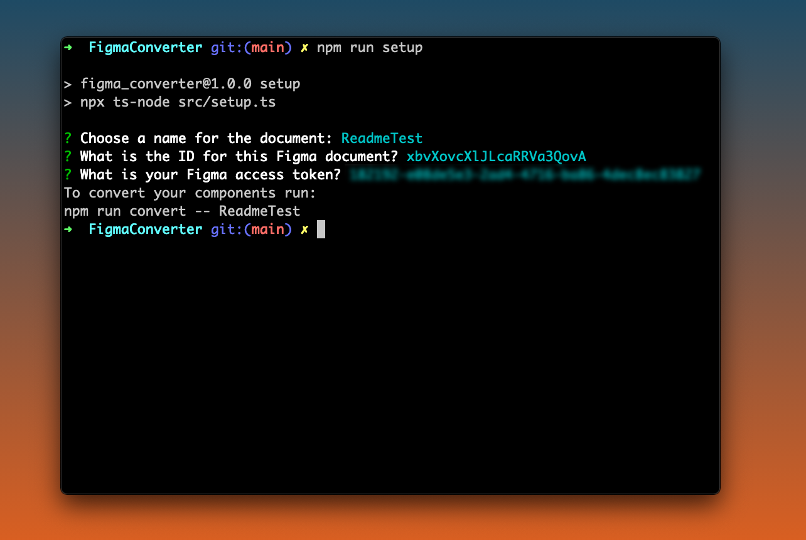

# FigmaConverter

FigmaConverter is a small program that let's you convert Figma components into [web-components](https://developer.mozilla.org/en-US/docs/Web/Web_Components) and Figma text/color styles into SCSS variables and mixins. 

*Note that this is still a prototype, and should not be used for production yet* 

## Building Figma Components (Designing)
<!-- The FigmaConverter uses the components feature from Figma. To get layouts and whitespace correct FigmaConveter also uses the auto-layout feature (which is very similar to *display: flex*). The components that you want to convert must be placed on the canvas itself. (not on in another frame). -->

To use your Figma components with FigmaConverter they need to be built using the [**Auto-layout**](https://help.figma.com/hc/en-us/articles/360040451373-Create-dynamic-designs-with-Auto-layout) feature. This needs to be used for **all elements** in the component. The components that you want to convert also needs to be placed in on the canvas itself (not in another frame).

The Auto-layout feature can be found in the right panel.  
For the most effective use of this feature please use the red marked button for further positioning.


### Naming Components 
Because of a dependency in web-components, the components must be named with two lowercased words with a dash between them.  
Example: “test-component.”


 Element names for the component | Screenshot of the component 
:-------------------------:|:-------------------------:
  | 

### Naming Elements
FigmaConverter uses the names of the elements as variable names. These variable names cannot be more than **25 characters** and cannot be identical in the same component.


## Installation (Developing)

Clone the repository from GitHub to install figmaConverter.

```bash
git clone https://github.com/Knowit-Experience-Norrland/FigmaConverter.git
```

Change directory and run npm install to install all necessary packages to run the program.
```bash
cd FigmaConverter/
npm install
```


## Dependencies
* LitElement
* Any sort of bundler that handles open imports, eg. import 'litElement'
  * Some examples are [Webpack](https://webpack.js.org/), [Parcel](https://parceljs.org/), [Rollup](https://rollupjs.org/guide/en/).

The system now relies on CSS *gap* (previously grid-gap) -- Which does not currently work in Safari.


## Setup
FigmaConverter focuses on single documents. To be able to get the information from the document an access token is needed. Run the setup script to fill in the information for the Figma document.

```bash
npm run setup
```

Three questions are asked: 
<!-- * What is the documents name? --> 
<!-- * What's your Figma document ID? -->
<!-- * What's your Figma access token? -->

The document name is what you will refer to when running the program. This could be anything that you'll associate with your document.  



The document ID can be found in the URL to your Figma document (see image below).


The access token can be generated under the account settings tab in Figma.


The configuration is set to a .env-file and read by the figmaConverter.ts-file.  

The setup can be run multiple times and to add more than one document. After the first run, you’ll be asked if you want to change your access token.


## Usage

To run FigmaConverter run the figmaConvert.ts file:

```bash
npm run convert -- DOCUMENT_NAME
```

<!-- To get the information of your compoents figmaConverter needs the figma document ID and an access token. --> 

<!--  -->


When the program has run it will result in some new files in the ***output/*** folder. These are TypeScript files that contain [litElements](https://lit-element.polymer-project.org/) for each Figma component. 

To compile these files to .js-files, making them runnable in the browser, we can use TypeScript compiler (tsc).

If not already installed, install typescript globally: 

```bash
npm install -g typescript
```

Then compile the typescript files:

```bash
cd output/
tsc 
```

If you want to test the components multiple times you can make the typescript compiler watch the output folder. Thereby running the compiler very time there is a change in a typescript file. This can be done with:

```bash
tsc -w 
```

### Test and Distribute components 
The way that the generated LitElement are structured they are very suitable to use a [NPM](https://www.npmjs.com/)-package. Inside the **/output** folder there is a package.json file. This file contains instructions on the package, such as the name of the package.   

Example package.json file:

```yaml
{
    "name": "component-package",
    "version": "1.0.0",
    "description": "this is package of litelements created by figma",
    "main": "index.js",
    "module": "index.js",
    "scripts": {
        "test": "echo \"error: no test specified\" && exit 1",
        "locallink": "tsc && npm link"
    },
    "author": "author authorson",
    "license": "isc",
    "dependencies": {
        "lit-element": "^2.4.0"
    },
    "devdependencies": {
        "typescript": "^4.2.2"
    },
    "keywords": [
        "litelement",
        "web-components",
        "figmaconverter"
    ]
}


```

<!-- With these litElement files, an additional package.json file is created. This can be used to distribute the components to [NPM](https://www.npmjs.com/). -->

#### Test locally
If you wish to test your components locally before you publish them navigate to your ***output/*** folder and type.

```bash
npm link 
```

Then navigate to your local project and type (where the package name is found in **/output/package.json**): 
```bash
npm link YOUR-PACKAGE-NAME
```

#### Publish to NPM
To [publish to npm](https://zellwk.com/blog/publish-to-npm/) you can log in to your npm account. 

```bash
npm login
```

Follow the instructions and then use:

```bash
npm publish
```


## Using the Components

The generated LitElement components are as a base a web-component therefore the components can be used in native HTML5 and in any framework (such as react and angular). To use the components import them in a JavaScript-file:

```JavaScript
import 'YOUR-PACKAGE-NAME'
```

Then use the components in HTML:

```HTML
<!DOCTYPE html>
<html lang="en">
<head>
    <meta charset="UTF-8">
    <title>Document</title>
</head>
<body>
  <my-component></my-component>
  <script src="./js/main.js"></script>
</body>
</html>
```

If the component is using a color/text style it must be imported in the .scss-file.


### Styling
If you wish to style your components after they've been made you can do that by targeting the name of the element you wish to change and then writing CSS to a string.


```HTML
  <test-component 
    textBox="
      background-color: red;
      border-radius: 15px;
    "
    title="
      font-family: Roboto;
      font-size: 2em;
    "
  >
  </test-component>
```

If you wish to style the parent element you can use the *style*-attribute 
```HTML
  <test-component 
    style="background-color: red;" 
  >
  </test-component>
```
or the name of the component as camel case:  

```HTML
  <test-component 
    testComponent="background-color: red;" 
  >
  </test-component>
```

These two examples will do the same thing.

### Figma Styles, Variables, and Mixins
Color, text and effect styles are a great feature in Figma. A little to great to not take advantage of. FigmaConverter uses the **color** and **text** styles (effects coming in the future). The styles are translated into the SCSS variables.

#### Using the Variables
Either copy the variables file in **/output/styles/** and use it in your project. To use the variables from a NPM-package import it from the package in your SCSS file with:

```SCSS
@import '~YOUR-PACKAGE-NAME/styles/variables';
```

Then you can use your color styles as variables with with the keyword ***color*** before the color style name.

The text styles are implemented as a mixin and can be used as such. With the keyword ***font*** before the figma text style name.

```SCSS
@import '~YOUR-PACKAGE-NAME/styles/variables';

h1{
  @include font-my-text;
  color: $color-my-color;
}
```

#### Setting up Figma styles
To use a style first set them in Figma.
To [create a style](https://help.figma.com/hc/en-us/articles/360038746534-Create-styles-for-colors-text-effects-and-layout-grids) choose your color or text style normally on a text or shape.

Click the four dots and then the plus sign on the text/color.  
This let's you create style. 

***IMPORTANT:*** as of now the styles that are created must be placed on the canvas itself. Otherwise FigmaConverter cannot find it. 

Create a shape/text and put it on the ***canvas*** not in another frame.  
Choose a color :


Click on the four dots and the plus sign:


Add your color/text style name:


Click on the canvas too see the color/text styles:


### Texts 
Often components are built as a template where the content is different for each instance of the component. To change the text of a component the name of the element is targeted with the addition of the keyword “Text.” Example:
If the element is named *title*.

```HTML
  <test-component 
    titleText="This is a new title"
  >
  </test-component>
```


### Images 
As of now the images that are used are implemented as URLs from Figmas API.  
***IMPORTANT***  
These URLs are only available for 14 days. To use these images permanently as of now is to set them as the background image of the element. 

```HTML
  <test-component 
    img="background-image: url(path/to/your/image)"
  >
  </test-component>
```

### Slots
Slots can be used to insert elements into your web-component. To use a slot with figmaConverter you first need to mark where you want the slot to be. This can be done with any element in Figma but needs to have the keyword "SLOT" before the name.

#### Example

Here a rectangle is used to fill the slots space. 


The slot name is slotName.


To use the slot in your project you can add any element in the component with the slot attribute matching the name from Figma. Here slotName.

```HTML
  <test-component>
    <button slot="slotName">Button</button>
  </test-component>
```


## Contributing
Pull requests are welcome. For major changes, please open an issue first to discuss what you would like to change.

## License
[MIT](https://choosealicense.com/licenses/mit/)


